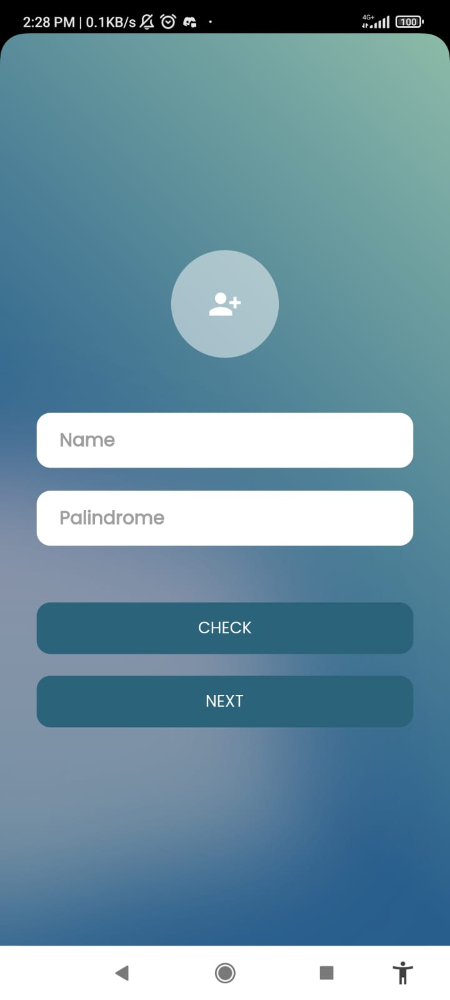
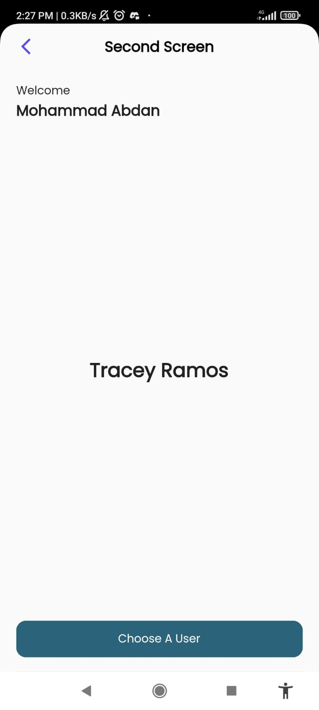
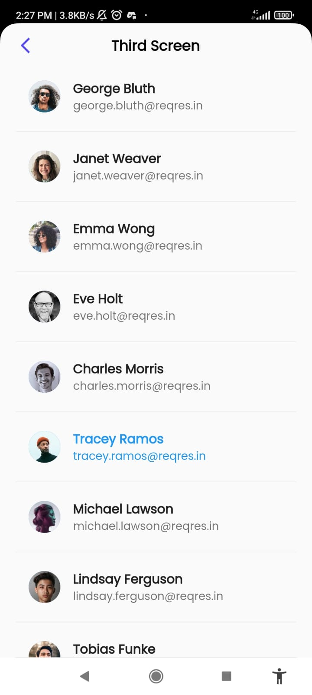

# Suitmedia Internship Technical Task

This project is developed as part of the technical task for the Suitmedia Internship. It is a Flutter application that showcases the usage of Riverpod as the state management solution.

## Project Overview

The goal of this project is to demonstrate proficiency in building a Flutter application with Riverpod. The application showcases the following features:

- Fetching a paginated list of users from an API endpoint.
- Displaying the list of users in a paginated manner.
- Selecting a user and displaying detailed user information.

## Screenshots

Here are some screenshots of the application:








## Prerequisites

Before running the project, ensure that you have Flutter and Dart installed on your development machine.

- Flutter installation guide: [Flutter Documentation](https://flutter.dev/docs/get-started/install)
- Dart installation guide: [Dart Documentation](https://dart.dev/get-dart)

## Getting Started

1. Clone the repository to your local machine:
   ```bash
   git clone https://github.com/your-username/suitmedia-internship-task.git
2. Change directory to the project folder:
    ```bash
    cd suitmedia-internship-task
3. Install the dependencies using the following command:
   ```bash
   flutter pub get
4. Run the application using the following command:
   ```bash
   flutter run
